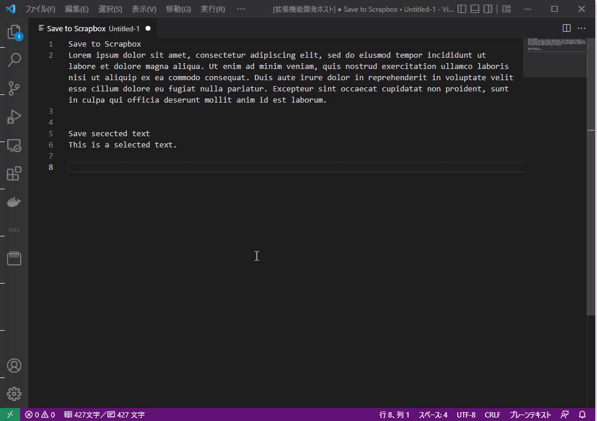

# SaveToScrapbox

SaveToScrapbox is a VSCode extension to save the text you are editing on VSCode to Scrapbox.

## Features

On the VSCode edit screen, select the text you wish to save to Scrapbox and execute the `SaveToScrapbox:Save` command.

A list of projects to save to will be displayed on the command palette. Enter or select the name of the project you wish to save to.

Then the default browser will open the saved Scrapbox article, so please make additional edits if necessary.

If you execute the above command without selecting anything on the editor, all text in the screen you are editing will be saved to Scrapbox.

The key bindings for the above command are assigned to `Ctrl+Alt+S` (Windows) and `Cmd+Ctrl+S` (Mac) by default.

## Requirements

You must be logged into Scrapbox with your default browser.

## Extension Settings

To use this extension, you must first configure the following settings.

Run the `SaveToScrapbox:Config` command to display the settings screen for this extension, and set the following items appropriately.

| Item | Description |
|------|-------------------|
| Footer | The common string to be given at the end of the saved text. A link format one is useful, for it will be able to consolidate copied contents from VSCode.  |
| Projects | Enter the name of the Scrapbox project (the string in the project name portion of the URL) where you want to save the text. If there are multiple projects, enter them separated by commas (,).  |

## Known Issues

## Release Notes

### 1.0.0

Initial release of SaveToScrapbox

